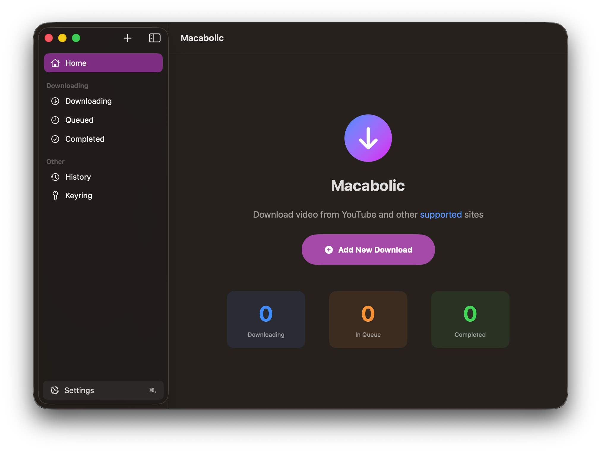
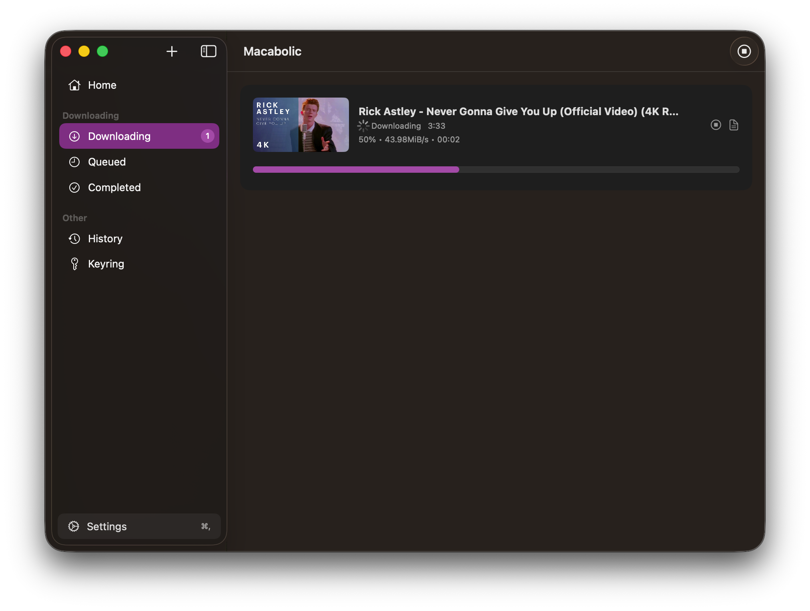

# Macabolic 🚀

A modern, fast, and beautiful video downloader for macOS. Powered by `yt-dlp`.

> ⚠️ **Note:** This project is currently under **active development**. You may encounter bugs or incomplete features. If you find any issues, please [open an issue](https://github.com/alinuxpengui/Macabolic/issues) so we can fix them!

<div align="center">
  
  <p>
    <a href="https://github.com/alinuxpengui/Macabolic/releases/latest/download/Macabolic-v2.1.3.dmg">
      
    </a>
    <a href="https://github.com/alinuxpengui/homebrew-macabolic">
      
    </a>
    <a href="https://github.com/alinuxpengui/Macabolic/releases">
      
    </a>
  </p>
  <p>
    <a href="https://mastodon.social/@macabolic_app">
      
    </a>
    <a href="https://bsky.app/profile/macabolicapp.bsky.social">
      
    </a>
    <a href="https://x.com/macabolic_app">
      
    </a>
  </p>
</div>

Macabolic is a native macOS frontend for the powerful [yt-dlp](https://github.com/yt-dlp/yt-dlp) command-line tool. It allows you to download videos and audio from YouTube and thousands of other supported sites with ease.

## Screenshots 📸

<div align="center">
  <table>
    <tr>
      <td width="50%"></td>
      <td width="50%"></td>
    </tr>
    <tr>
      <td width="50%"></td>
      <td width="50%"></td>
    </tr>
  </table>
</div>

---

## Support My Journey ❤️

It’s about the motivation of knowing my work truly helped someone and made their life a little easier. Your support is what keeps me building and improving these tools for everyone.

### 🏆 The "First 5" Wall of Fame
To show my gratitude, the **first 5 sponsors** of any amount will be **permanently featured** in the "About" section of the Macabolic app. Your name will be part of the app's history forever!

[👉 Become a Sponsor on GitHub](https://github.com/sponsors/alinuxpengui)

---

## Roadmap 🗺️

Here is what I'm planning to bring to Macabolic in the near future:

- [ ] **Official Apple Notarization:** Removing the "Unidentified Developer" warning for a professional experience.
- [ ] **Browser Extensions:** One-click download directly from Safari, Chrome, and Firefox.
- [ ] **Custom Post-Processing:** More tools to trim, convert, and manage your downloaded files.

---

## Features ✨

- **Native macOS Experience:** Built with SwiftUI for a seamless look and feel.
- **Vast Site Support:** Downloads from YouTube, Vimeo, Twitter, and [thousands more](https://github.com/yt-dlp/yt-dlp/blob/master/supportedsites.md).
- **Multiple Formats:** Support for MP4, WebM, MP3, Opus, FLAC, and WAV.
- **High Quality:** Up to 4K (2160p) resolution support.
- **Smart Features:**
  - Embed subtitles, metadata, and thumbnails into your files.
  - **SponsorBlock** integration to automatically skip sponsors and intros.
  - Playlist downloading support.
  - Concurrent download management.
- **Multi-language:** Supports English and Turkish (automatically detects system language).
- **Auto-Update:** Self-manages `yt-dlp` updates to ensure maximum compatibility.

## Installation 🚀

### Option 1: Homebrew (Recommended)

```bash
brew tap alinuxpengui/macabolic
brew install --cask macabolic
```

### Option 2: Manual Download

- **Download:** Download the latest `Macabolic.dmg` from the [Releases](https://github.com/alinuxpengui/Macabolic/releases) page.
- **Install:** Open the DMG file and drag **Macabolic** to your `Applications` folder.
- **First Launch:** Since the app is not notarized, you may need to right-click the app and select **Open**, or go to `System Settings > Privacy & Security` and click **Open Anyway**.
- **Initial Setup:** When the app opens, you will be greeted by a **Legal Disclaimer**. Please read and confirm it. Go to **Preferences (⌘,)** to set your **Language** and **Default Save Folder**.

## Build Requirements 🛠️

- macOS 13.0 or later (Ventura+)
- Xcode 14.0 or later
- Swift 5.7+

## Credits ❤️

- **Parabolic by Nickvision:** This project is a macOS-native port based on the original [Parabolic](https://github.com/NickvisionApps/Parabolic) application.
- **yt-dlp:** The core engine that makes video downloading possible.

## Legal Disclaimer ⚖️

This tool is intended solely for personal use and educational or research purposes.
Videos on YouTube and other sites may be subject to DMCA protection. The authors of Parabolic/Macabolic do not endorse, and are not responsible for, the use of this application in means that will violate these laws.
Downloading videos from YouTube may violate their Terms of Service unless the video has an explicit download button or the content is licensed in a way that permits downloading.
By using this app, you assume full responsibility for any content you download and how you use it. The developer does not condone or support any misuse of this tool to infringe upon copyrights or violate platform rules.

## License ⚖️

This project is licensed under the **GNU General Public License v3.0**. See the [LICENSE](LICENSE) file for details.

---
**Maintained by [alinuxpengui](https://github.com/alinuxpengui)**

## Star History

[](https://www.star-history.com/#alinuxpengui/Macabolic&type=date&legend=top-left)
